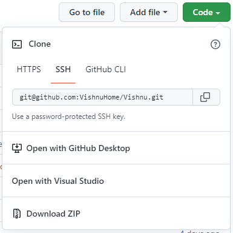

# Vishnu
Vishnu ist eine Monitoring- und Prozesssteuerungssoftware mit integrierter Verarbeitung erweiterter logischer Ausdrücke.

*So sieht Vishnu nach dem Start mit dem ersten Demo-Job ungefähr aus*.

## Schnellstart

Für die erste Einrichtung führe bitte nachfolgende Schritte aus:
  - ### Vorbereitung:
	* Ein lokales Basisverzeichnis für alle weiteren Vishnu- und Hilfs-Verzeichnisse anlegen, zum Beispiel c:\Users\<user>\Documents\MyVishnu
	* #### Wichtig: Eine Umgebungsvariable "Vishnu_Root" auf den Pfad zu diesem Verzeichnis setzen, z.B.: Vishnu_Root=c:\Users\<user>\Documents\MyVishnu.

  - ### Installation:
	* https://github.com/VishnuHome/Setup/raw/master/Vishnu.bin/init.zip herunterladen und in das Basisverzeichnis entpacken.

	Es entsteht dann folgende Struktur:
      
	

	### Vishnu-Demo:

	- Im Verzeichnis ReadyBin/Vishnu.bin das Script **Vishnu_Demo.bat** starten.

## Demos
Im Unterverzeichnis **DemoJobs** findest du die Job-Definitionen einer Reihe von interessanten Demonstrations-Jobs.

## Dokumentation
Die ausführliche Dokumentation findest du unter
[Vishnu.Doc](https://github.com/https://github.com/VishnuHome/Vishnu/releases/latest/download/Vishnu_doc.de.chm)
oder online unter
[Vishnu online Dokumentation](https://neteti.de/Vishnu.Doc/)

## Quellcode und Entwicklung

Es gibt grundsätzlich zwei unabhängige Vorgehensweisen:
  - Wenn du kein Team-Mitglied der Organisation **VishnuHome** bist (das ist der Normalfall),
    dann lies einfach hier weiter.
  - Team-Mitglieder lesen bitte den Abschnitt [Quellcode und Entwickung für Team-Mitglieder](##Quellcode-und-Entwicklung-fuer-Team-Mitglieder)

---

1. Forken des Repositories **Vishnu** über den Button Fork

   
2. Clonen des geforkten Repositories **Vishnu** in das existierende Unterverzeichnis
	.../MyVishnu/**VishnuHome**
	
	- a) in der git-bash über git clone:

		  cd VishnuHome
		  git clone git@github.com:VishnuHome/Vishnu.git

	- b) über "Open with GitHub Desktop", wenn du die Desktop-Anwendung bevorzugst
	
	- c) über "Download ZIP" kommst du zwar auch an den Quellcode von Vishnu, 
	     hast dann aber keine Anbindung an dein geforktes Repository auf github.
	
   
	

## Quellcode und Entwicklung fuer Team-Mitglieder

Wechsle bitte in das Repository [Setup](https://github.com/VishnuHome/Setup) und folge den Anweisungen im dortigen README.md.

## Mitmachen (Contributing)
Wenn du Fehler entdeckst oder Verbesserungsvorschläge einbringen willst, eröffnest du am besten ein neues Diskusionsthema ("New issue"). 
Bitte prüfe aber vorher, ob ein passendes Thema nicht vielleicht schon existiert.

#### Änderungen und Debugging am Vishnu-Quellcode

**Wichtig:** Mach möglichst keine Änderungen, Korrekturen oder Erweiterungen
am master-branch des Vishnu-Quellcodes, sondern lege zuerst einen neuen **feature-branch** an. 
Nur so kannst du später deine Verbesserungen auch dem Vishnu-Team zurückliefern.

### Viel Spass mit Vishnu!
