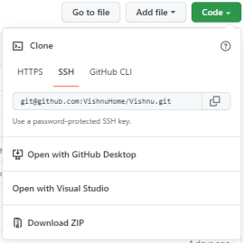

# Vishnu
Vishnu ist eine Monitoring- und Prozesssteuerungssoftware mit integrierter Verarbeitung erweiterter logischer Ausdrücke.

*So sieht Vishnu nach dem Start mit dem ersten Demo-Job ungefähr aus*.

## Schnellstart

Für die erste Einrichtung führe bitte nachfolgende Schritte aus:
  - ### Vorbereitung:
	* Ein lokales Basisverzeichnis für alle weiteren Vishnu- und Hilfs-Verzeichnisse anlegen, zum Beispiel c:\Users\<user>\Documents\MyVishnu
	* #### Wichtig: Eine Umgebungsvariable "Vishnu_Root" auf den Pfad zu diesem Verzeichnis setzen, z.B.: Vishnu_Root=c:\Users\<user>\Documents\MyVishnu.

  - ### Installation:
	* https://github.com/VishnuHome/Setup/raw/master/Vishnu.bin/init.zip herunterladen und in das Basisverzeichnis entpacken.

	Es entsteht dann folgende Struktur:
      
	

	### Vishnu-Demo:

	- Im Verzeichnis ReadyBin/Vishnu.bin das Script **Vishnu_Demo.bat** starten.

## Demos
Im Unterverzeichnis **DemoJobs** findest du die Job-Definitionen einer Reihe von interessanten Demonstrations-Jobs.

## Dokumentation
Die ausführliche Dokumentation findest du unter
[Vishnu.Doc](https://github.com/https://github.com/VishnuHome/Vishnu/releases/latest/download/Vishnu_doc.de.chm)
 (Hinweis: Wenn die Hilfedatei (*.chm) nicht korrekt angezeigt werden sollte, sieh bitte [hier](CHM_HowTo.md) nach.)

oder online unter
[Vishnu online Dokumentation](https://neteti.de/Vishnu.Doc/)

## Quellcode und Entwicklung

Es gibt grundsätzlich zwei unabhängige Vorgehensweisen:
  - Wenn du kein Team-Mitglied der Organisation **VishnuHome** bist (das ist der Normalfall),
    dann lies einfach hier weiter.
  - Team-Mitglieder lesen bitte den Abschnitt [Quellcode und Entwickung für Team-Mitglieder](#Quellcode-und-Entwicklung-fuer-Team-Mitglieder)

---

1. Forken des Repositories **Vishnu** über den Button Fork

   
2. Clonen des geforkten Repositories **Vishnu** in das existierende Unterverzeichnis
	.../MyVishnu/**VishnuHome**
	
	- a) in der git-bash über git clone:

		  cd VishnuHome
		  git clone git@github.com:VishnuHome/Vishnu.git

	- b) über "Open with GitHub Desktop", wenn du die Desktop-Anwendung bevorzugst
	
	- c) über "Download ZIP" kommst du zwar auch an den Quellcode von Vishnu, 
	     hast dann aber keine Anbindung an dein geforktes Repository auf github.
	
   
	

## Quellcode und Entwicklung fuer Team-Mitglieder

Wechsle bitte in das Repository [Setup](https://github.com/VishnuHome/Setup) und folge den Anweisungen im dortigen README.md.

## Die Vishnu-Plugins
Vishnu ist nur die Logik-Maschine, die eigentliche Arbeit machen die Vishnu-Plugins.
Vishnu-Plugins sind kleine Programmteile (DLLs), die von Vishnu zur Laufzeit geladen werden.
Zu den Vishnu-Plugins gehören neben anderen die Checker. 
Checker sind die wesentlichen Vishnu-Akteure. Sie machen die Prüf-Arbeit und liefern
Prüfergebnisse zurück (siehe auch in der Hilfe [Vishnu Akteure](https://neteti.de/Vishnu.Doc/html/bc0ffa08-c936-4fad-8fdb-dbd2279fc360.htm)
und [eigene Checker](https://neteti.de/Vishnu.Doc/html/a3f9771a-ac24-46c0-97df-d2bde6a990e8.htm)).
Vishnu liefert schon eine Reihe von Checkern mit. Diese findest du unter [InPlug](https://github.com/InPlug).

Vishnu-Plugins kannst du genauso forken und clonen wie unter [Quellcode und Entwickung](#Quellcode-und-Entwicklung) schon beschrieben,
nur dass dein lokales Root-Verzeichnis **InPlug** sein sollte.

## Mitmachen (Contributing)
Wenn du Fehler entdeckst oder Verbesserungsvorschläge einbringen willst, eröffne bitte zuerst ein neues Diskusionsthema ("New issue"). 
Bitte prüfe aber vorher, ob ein passendes Thema nicht vielleicht schon existiert.

#### Änderungen und Debugging am Plugin- oder Vishnu-Quellcode

**Wichtig:** Mach möglichst keine Änderungen, Korrekturen oder Erweiterungen
am master-branch des Quellcodes, sondern lege zuerst einen neuen **feature-branch** an. 
Nur so kannst du später deine Verbesserungen auch dem Vishnu-Team zurückliefern.

Da der Vishnu-Kernel besonders hohen Anforderungen an Korrektheit, Stabilität und Performance unterliegt,
solltest du vielleicht mit Korrekturen, Erweiterungen an - oder Neuerstellung von - Vishnu-Plugins beginnen.
Der Vishnu-Kernel ist darüber hinaus sehr testaufwendig, weshalb Reaktionen des noch sehr kleinen Teams länger
auf sich warten lassen können.

#### Änderungen am Quellcode in das Original-Repository zurückspielen

Wenn du Änderungen am Plugin- oder Vishnu-Quellcode vorgenommen und ausführlich getestet hast, kannst du deinen **feature-branch** an das Vishnu-Team über einen **"pull request"** zurückliefern. Das Vishnu-Team begutachtet und testet dann diesen Branch und übernimmt diesen bei Erfolg in Vishnu-master.
Bitte versuche nicht, einen direkt geänderten master-branch zurückzumelden - wir würden das zurückweisen.

**Ein Hinweis in eigener Sache: das Vishnu-Team ist aktuell (Juli 2022) noch sehr klein, weshalb die Bearbeitung deiner Anfragen und Änderungen länger dauern kann!**

### Viel Spass mit Vishnu!
